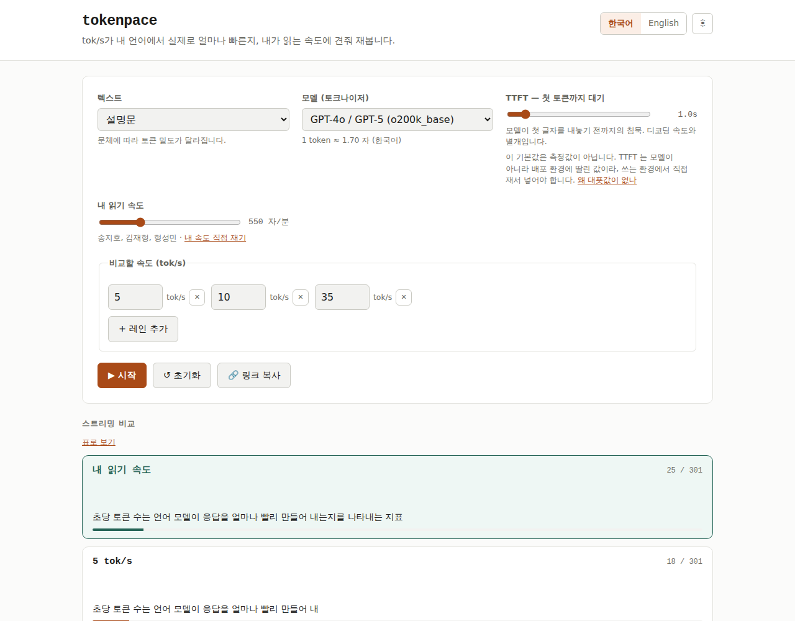
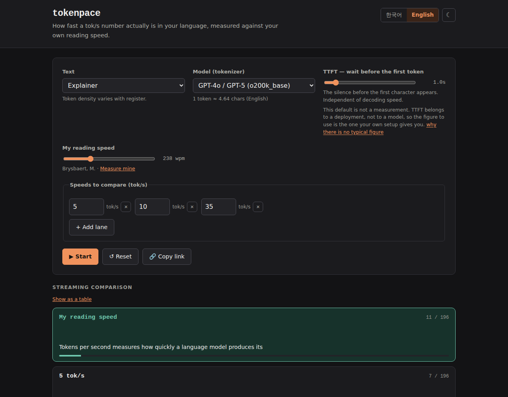
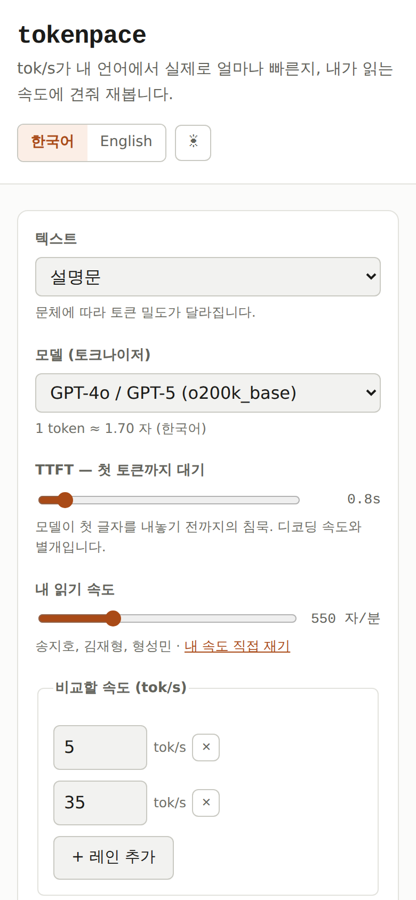
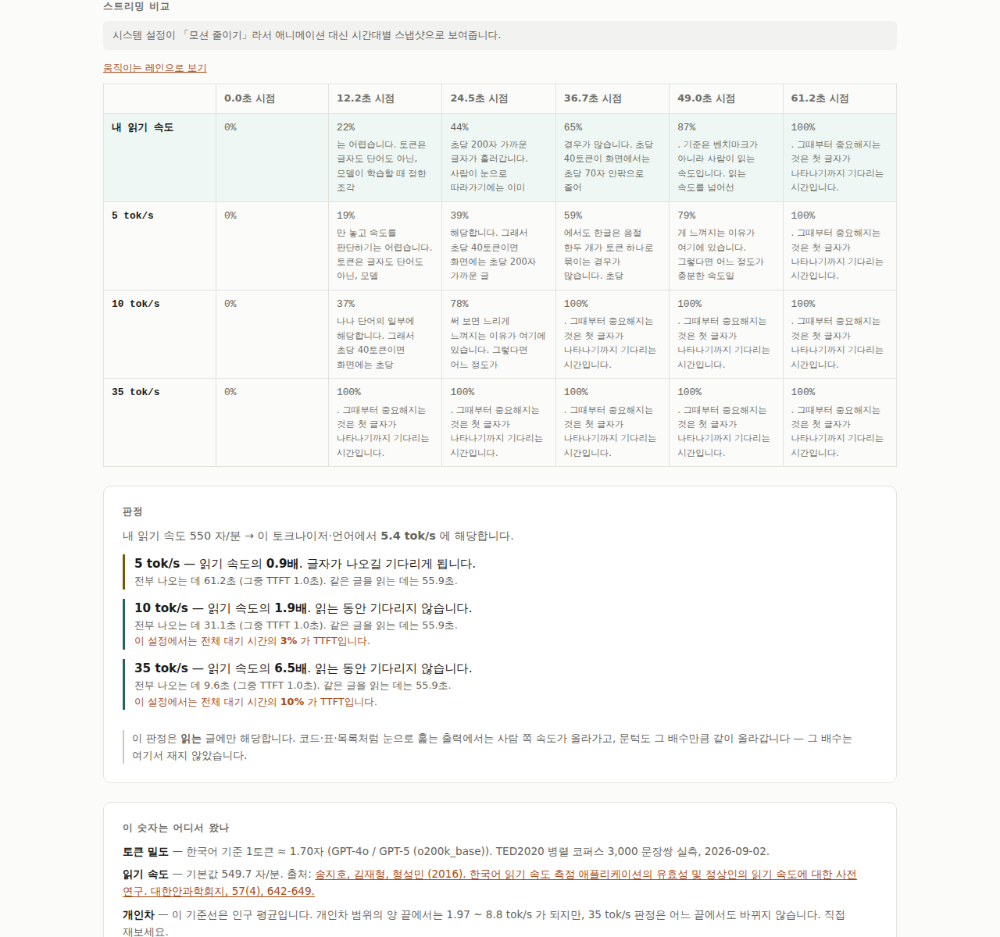

# tokenpace

[](https://github.com/woongstardev/tokenpace/actions/workflows/ci.yml)

**How fast is a tok/s number, really — in your language, against your reading speed?**

Benchmarks report tokens per second. People read characters. Converting one into
the other takes a tokenizer, and the answer moves by 2× depending on which one.
tokenpace measures that conversion — six tokenizers, four languages, 3,000
sentence pairs each — and then draws the baseline the other visualisers leave
out: your own reading speed, in tok/s. It lands near 5, in English and, to our
surprise, in Korean too. **On prose you actually read, past roughly 10 tok/s the
model already outruns you; what you still feel is the wait for the first token,
and how long the answer is.** Output you skim rather than read — code, tables,
long lists — moves that threshold up by however much faster you skim, and this
project has not measured that factor.

> Live at **<https://tokenpace.woongstar.com/>** — or run it locally, see [Running it](#running-it).
>
> MIT for the code, CC BY 4.0 for the measurements, CC0 for the samples — see [LICENSES.md](LICENSES.md).



<details>
<summary>English, dark, and on a phone</summary>





</details>

Screenshots are generated from the real page — `node tools/capture.mjs` — so
they cannot quietly stop matching it.

---

## What is different here

Streaming-speed visualisers are a crowded genre. Three things in this one are
not in the others:

**1. Language is a first-class variable, and the numbers are measured.**
One token is 4.65 characters of English and 1.70 characters of Korean on
`o200k_base` — and 1.02 on `cl100k_base`. Every other tool in this category is
implicitly English-only. Ours ships six tokenizers × four languages, measured on
3,000 parallel sentence pairs each, with the script that produced them.

**2. TTFT is included.** The wait before the first token is most of what "slow"
feels like once decoding is fast, and the tools that mention it mostly exclude
it on purpose. What this project does *not* do is tell you what a typical TTFT
is. There is no such number: TTFT belongs to a deployment — hardware,
quantisation, prompt length, cache state, queue depth — and moves across more
than two orders of magnitude between them. The slider starts at a round one
second, the page says on its face that this is a setting rather than a
measurement, and [`data/ttft-sources.json`](data/ttft-sources.json) records why
and what would have to be measured to replace it.

**3. There is a baseline.** "Is 35 tok/s fast" has no answer. "Does 35 tok/s
outrun me" does. Human reading speed converts to roughly **5 tok/s** — close
enough across English and Korean that the two overlap, which surprised us. The
page renders that as a lane you race against, and lets you replace the
population average with your own measured speed, because the published standard
deviation is 63% of the mean.

## The measurements

Full tables in [`docs/token-density.md`](docs/token-density.md) and
[`docs/reading-speed.md`](docs/reading-speed.md) — both bilingual, Korean first,
English below it in the same file. The short version:

**Characters one token renders as**

| Tokenizer | English | 한국어 | 日本語 | 中文 |
|---|---:|---:|---:|---:|
| GPT-4o / GPT-5 (`o200k_base`) | 4.65 | 1.70 | 1.33 | 1.30 |
| GPT-4 (`cl100k_base`) | 4.54 | 1.02 | 0.96 | 0.87 |
| Llama 3.1 | 4.54 | 1.67 | 1.45 | 1.28 |
| Qwen3 | 4.51 | 1.53 | 1.50 | 1.53 |
| Gemma 3 | 4.46 | 1.86 | 1.89 | 1.57 |
| Mistral Small 3 | 4.48 | 1.94 | 1.38 | 1.15 |

**Reading speed, expressed as tok/s**

| | English | 한국어 |
|---|---:|---:|
| `o200k_base` | 4.7 | 5.4 |
| across all six tokenizers | 4.7 – 4.9 | 4.7 – 9.0 |

Sources: [Brysbaert 2019](https://doi.org/10.1016/j.jml.2019.104047) (238 wpm,
190 studies, n=18,573) and [송지호 외 2016](https://www.jkos.org/upload/pdf/JKOS057-04-17.pdf)
(549.7 chars/min, n=42). Japanese and Chinese ship **without** a reading
baseline: no source we trust was found, and a plausible-looking invented default
would be worse than an empty field. The reasoning is recorded in
[`data/reading-speed-sources.json`](data/reading-speed-sources.json).

## Citing this

The measurements are the product here, so they come with a citation:

> Woongstar (2026). *tokenpace: token density by language, and reading speed
> converted to tok/s* (measured 2026-09-02).
> <https://tokenpace.woongstar.com/>

[`CITATION.cff`](CITATION.cff) carries the machine-readable version — GitHub's
"Cite this repository" button reads it, as do Zotero and cffconvert. It ships
with the site as well as the repository, so a citation keeps resolving even if
this repository does not.

The licence to respect is **CC BY 4.0** on `data/` and `docs/`: use the numbers
freely, name where they came from. There is no DOI yet.

## Reproducing the numbers

Nothing here is a figure someone typed in. Everything regenerates:

```sh
cd tools
npm ci
npm run all      # fetch corpora → measure density → derive reading pace → build site data
```

Three properties make that a real reproduction rather than a gesture:

- **No randomness.** The corpus sample is a fixed stride, so two runs pick the
  same sentences.
- **Pinned inputs.** Archive checksums live in
  [`corpus/CHECKSUMS.json`](corpus/CHECKSUMS.json); if upstream republishes, the
  run fails instead of quietly changing the published figures.
- **No account required.** FLORES-200 is the usual corpus for this and it is
  gated behind a Hugging Face login, so we use TED2020 instead. A reproduction
  that needs credentials is not one.

## Running it

The site is plain HTML, CSS and ES modules. There is no build step and no
runtime dependency — but ES modules need a real origin, so serve the directory
rather than opening the file:

```sh
python3 -m http.server 8000
# http://localhost:8000
```

Tests:

```sh
node --test "tests/*.test.mjs"   # unit tests
node tools/check-site.mjs        # project invariants: no external requests, intact vendor, live links
node tools/check-a11y.mjs        # axe, across light / dark / reduced-motion / 390px
```

Images (README screenshots and the social card) regenerate from the page itself:

```sh
node tools/capture.mjs
```

They are committed rather than checked: a screenshot of an animation is never
byte-identical twice, so CI has no way to verify one.

CI runs those three on every push. Separately, once a week, it does the whole
thing again from nothing: downloads the corpora from
[OPUS](https://opus.nlpl.eu/TED2020/corpus/version/TED2020) over the network,
checks them against the committed hashes, re-runs every script and diffs the
result against what is in the repository. A single changed digit fails the
build, because at that point the numbers in `docs/` are no longer the numbers
the scripts produce.

The same run also asks a question reproduction cannot: whether the table is
still *current*. Every Hub tokenizer is pinned to a commit, and
`tools/check-freshness.mjs` compares the tokenizer files at that pin against
the ones at the branch head — so an upstream edit is reported with the file
that moved, instead of surfacing later as an unexplained diff. It also refuses
to let the measurement quietly age: past 180 days it says so, past a year it
fails. What it cannot detect is a new model family shipping. Nothing can; that
one is a person's job, and the failing build is how the person gets asked.

That job is the one claim this project cannot afford to have untested, so it
has been run end-to-end on demand rather than waited for:
[run 33638579970](https://github.com/woongstardev/tokenpace/actions/runs/33638579970)
re-derived all six tokenizers × four languages from a fresh download and came
out identical, in 55 seconds. You can do the same — the workflow is
`workflow_dispatch`-enabled, so anyone with a fork can press the button.

## How it is built

```
index.html              the whole page
assets/
  og.png                GENERATED — the social card
  css/app.css           one stylesheet, light and dark
  js/
    main.js             wiring: state → render, event handlers
    engine.js           the streaming clock (see below)
    token-pieces.js     splitting text into tokens, exactly and approximately
    tokenize.js         choosing between precomputed / exact / approximate
    i18n.js             ko + en strings
    url-state.js        the entire configuration, in the query string
    reading-test.js     measuring your own reading speed
  data/                 GENERATED — density figures and pre-tokenised samples
  vendor/               GENERATED — the tokenizer, vendored (MIT)
corpus/                 sample texts (CC0) + checksums for the downloaded corpus
data/                   GENERATED measurements + hand-curated sources
docs/                   GENERATED reports + screenshots
tools/                  the measurement harness, the checkers, the screenshotter
tests/                  node:test
```

**The clock.** Every lane is a pure function of elapsed wall-clock time:
`due(t) = floor((t − ttft) × tok/s)`. Nothing accumulates per frame, so a
dropped frame cannot desynchronise two lanes, and a 120 Hz display does not run
the animation at double speed. Hidden tabs throttle `requestAnimationFrame` to
about 1 Hz, so the clock stops on `visibilitychange` and says how long it was
paused instead of dumping the backlog on return.

**Token boundaries.** Byte-level BPE splits a Hangul syllable across two tokens
routinely, and decoding a prefix that ends mid-character puts a replacement
character *in the middle* of the string, not at the end. The obvious
delta-by-length approach corrupts the output while the final decode still
matches — so the obvious integrity check passes and the bug ships. It did ship,
briefly; [`assets/js/token-pieces.js`](assets/js/token-pieces.js) explains the
fix and [`tests/site.test.mjs`](tests/site.test.mjs) pins it.

**Accessibility.** The page is an animation by nature, which makes
`prefers-reduced-motion` a correctness requirement rather than a nicety. Under
it, the lanes become a table of timed snapshots carrying the same information —
and a button offers that table to everyone else too, because the people an
animation serves worst are not the same set as the people who asked their OS to
reduce motion.

Announcements are treated as a budget rather than a feature. The page has one
live region, and what goes into it is a sentence. That is a correction: the
verdict block used to carry `aria-live` itself and is re-rendered on every
`input` event, so dragging the TTFT slider for under two seconds queued 33
announcements and roughly fifteen thousand characters of speech — with axe
reporting a clean page, because axe reads a page standing still and has no way
to see how often a region changes. `tools/check-a11y.mjs` now performs the drag
and fails if one gesture costs more than three announcements or 400 characters;
the same drag costs one announcement of 67 characters today.



**Privacy.** No backend, no analytics, no cookies, no storage. State lives in
the URL, which is also how sharing works. The Content Security Policy in
[`_headers`](_headers) blocks every external origin, and there is nothing in the
page that would want one.

## Contributing

See [CONTRIBUTING.md](CONTRIBUTING.md). The most useful contributions are a
sourced reading-speed baseline for a new language, a tokenizer worth adding, or
a demonstration that one of the measurements is wrong.

## Licence

Code MIT, measurements CC BY 4.0, sample texts CC0. Details and third-party
notices in [LICENSES.md](LICENSES.md).
